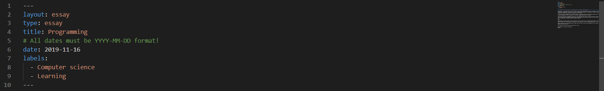

Programing, a continious process, where one learns how to structure the expression. We do it constantly in real life. Programming is a clear and consize way of expression following a set of rules. Arguably after mathematics, programming is the other language that everyone in our world understands. Perhaps that is why latin characters are so prevalent. 

I have been keen on progamming since my bachelor degree. I have always been inclined towards concepts clearly expressed. Don't missunderstand, by no means programming is free from nuances. In fact every langauge bring some to the table. 

The more you learn about programming, the more you will understnand that there is much more to learn. I often wonder around like a chind only to be ever more facinated. A very avid professional once told me that we are all amature trying to act like we know. I find it thought provoking, in today's Google search information flow do we need to memorize? 

Mhmm!

Programming is just like riding a cycle or learning to swim. One tries, fails, tries again and learns in the process. Any "good" programmer who writes a piece code flwlessly has once strgulled. So, never hesitate to fail but always rememer there is a lot more to learn. 

Where to begin? if you are wondering where to begin then my advice is pick up any language and start. Afterall the core of programming in any language is nothing but that. 

With that essay I hope you are now ready to give it a go?

Help another, for you have received it!
Sambeet

